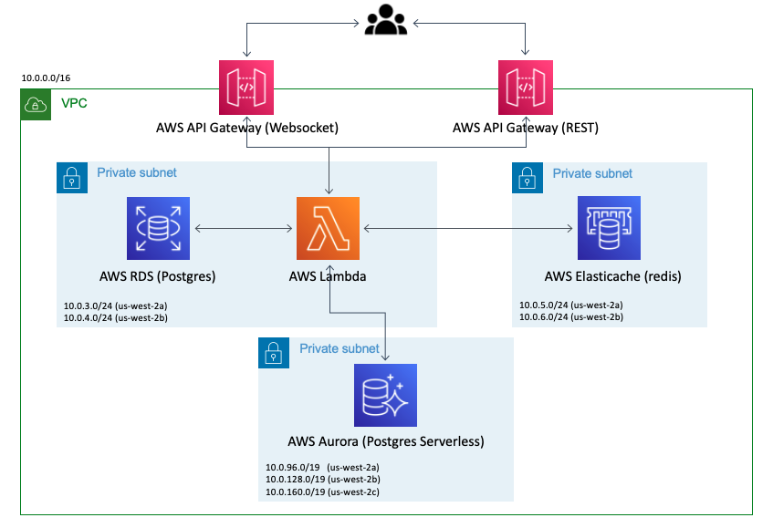
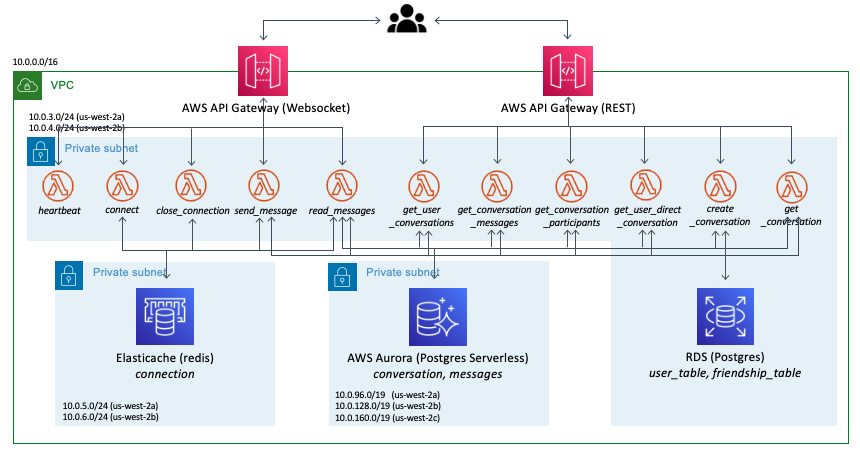

# chat-api

## Architecture

### Architecture Overview Diagram



### Architecture Details Diagram



## Components

### AWS RDS (Postgres)

* We expose AWS RDS via AWS RDS Proxy.
* The schema is defined in [user-api](https://github.com/PageNow/user-api).
* The permission for Lambda to access AWS RDS Postgres is set up in `lib/chat-api-stack.ts.`

### AWS Elasticache

We use a single REDIS cluster with two fields - `chat_user_connection`, `chat_connection_user`.

* `chat_user_connection` stores { user_id: connection_id } and `chat_connection_user` stores { connection_id: user_id }. They are used to manage connection ids for each user.

### AWS Aurora (Postgres Serverless)

We use serverless Aurora Postgres for easier autoscaling. It stores all the data related to chat functionalities. The table definition is written `db_init.sql`.

* `conversation_table` stores metadata about each conversation.

* `participant_table` stores the relationship between conversations and their participants. A row is defined as a [conversation, user] pair. Thus, the number of rows for each conversation equals the number of participants in each conversation.

* `message_table` stores message data. It has *conversation_id* as an attribute to indicate which conversation the message is part of.

* `message_is_read_table` stores data of whether a user read a message or not. Its purpose is to indicate whether a user has unread messages or not.

### AWS Lambda

It provides all the chat functionalities with serverless framework.

* `heartbeat` is invoked via websocket every several minutes by Chrome extension background.js. AWS Websocket has idle timeout of 10 minutes, so heartbeat is sent through websocket to keep the connection alive.

* `connect` is invoked via websocket when a user connects. It sets the user's connection id in *chat_user_connection* and *chat_connection_user* Redis fields.

* `close_connection` is invoked via websocket when a user closes connection. It removes connection information in *chat_user_connection* and *chat_connection_user* Redis fields.

* `send_message` is invoked via websocket when a user sends a message. It saves the new message in *message_table* and sets the message as read for the sender. Then, it posts the new message to the user's friends who are online via the websocket connection.

* `read_messages` is invoked via websocket when a user reads a message/conversation. It updates the rows in *message_is_read_table*. 

* `get_user_conversations` is invoked via REST Api. It returns the user's conversations with additional details (e.g. content of the most recent message, whether the user read the latest message or not, and etc.) obtained via SQL query. This data is displayed in the user conversation list page.

* `get_conversation_messages` is invoked via REST Api. It returns the messages in a conversation.

* `get_conversation_participants` is invoked via REST Api. It returns the participants of a conversation.

* `get_user_direct_conversation` is invoked via REST Api. For a given target user, it returns the conversation id of the one-on-one conversation with the target user. It returns null if the one-on-one conversation does not exist.

* `create_conversation` is invoked via REST Api. It creates a new conversation.

* `get_conversation` is invoekd via REST Api. It returns the information of a conversation given as input parameter.

### AWS API Gateway

* REST API - Provides endpoint for CRUD operations of conversations.

* Websocket API - Provides websocket connection for Chrome extension background.js to send and retrieve message data.

## Setup

### Environment Variables

In `.env` set the following environment variables.
```
COGNITO_REGION=<AWS region>
COGNITO_POOL_ID=<AWS Cognito User Pool Id>

VPC_ID=<VPC of the backend>
PRIVATE_ROUTE_TABLE_ID=<Route Table id of subnets AWS RDS resides in>
PRIVATE_SUBNET1_ID=<Id of subnet1 AWS RDS resides in>
PRIVATE_SUBNET2_ID=<Id of subnet2 AWS RDS resides in>

SUBNET1_AZ=<Availability zone of subnet1 (e.g. us-west-2a)>
SUBNET2_AZ=<Availability zone of subnet2>

RDS_PROXY_SG_ID=<Security Group of AWS RDS Proxy>
RDS_PROXY_HOST=<AWS RDS Proxy Host>
RDS_PORT=<AWS RDS Port Number>
RDS_DB_NAME=<AWS RDS database name>
RDS_USERNAME=<AWS RDS username>
RDS_PASSWORD=<AWS RDS password>

RDS_PROXY_ARN=<AWS RDS Proxy arn>
RDS_PROXY_NAME=<AWS RDS Proxy name>

LAMBDA_SG_ID=<AWS Lambda Security Group if it exists. 'none' otherwise>
REDIS_SG_ID=<AWS Elasticache Security Group if it exists. 'none' otherwise>
REDIS_ENDPOINT_ADDRESS=<Elasticache primary endpoint host if it exists. 'none' otherwise>
REDIS_ENDPOINT_PORT=<Elasticache primary endpoint port if it exists. 'none' otherwise>

REST_API_DEPLOY_STAGE=prod
WEBSOCKET_API_DEPLOY_DEV_STAGE=dev
WEBSOCKET_API_DEPLOY_PROD_STAGE=prod

CLIENT_URL=<Url of the chat client>
```

### CDK Bootstrap

For initialization, bootstrap AWS CDK by runnin
```shell
cdk bootstrap aws://<AWS Account Id>/<AWS Region>
```
Refer to https://docs.aws.amazon.com/cdk/latest/guide/bootstrapping.html for more details.

## Deployment

* Run `cdk deploy --outputs-file chat-api.json`.
* On AWS console, deploy ChatWebsocketApi Prod API manually since autoDeploy is set to False.

## Setting Up the Database

* On the `Query Editor` of AWS RDS console, copy the content of [db_init.sql](./db_init-sql) to the editor and run it.

## Tests

Note that tests are not functional right now. They are to be updated soon.

## References

* https://docs.aws.amazon.com/cdk/api/latest/docs/aws-appsync-readme.html#Object-Types
* https://aws.amazon.com/ko/blogs/mobile/building-scalable-graphql-apis-on-aws-with-cdk-and-aws-appsync/
* https://www.theelastic.guru/rosius/build-a-graphql-api-on-aws-with-cdk-python-appsync-and-dynamodb-part-1-1pjl


### CDK-DynamoDB

* https://docs.aws.amazon.com/cdk/api/latest/docs/aws-dynamodb-readme.html#amazon-dynamodb-construct-library
* https://appsync-immersionday.workshop.aws/lab1/2_deploy-with-cdk.html
* https://docs.aws.amazon.com/cdk/api/latest/python/aws_cdk.aws_appsync/README.html
* https://github.com/aws-samples/aws-cdk-examples/blob/master/typescript/appsync-graphql-dynamodb/index.ts
* https://medium.com/@sam.goodwin1989/type-safe-infrastructure-part-2-graphql-apis-with-aws-appsync-d1225e4e21e3
* https://www.itonaut.com/2018/12/02/define-apigateway-lambda-and-dynamodb-using-aws-cdk/

### AppSync

* https://www.youtube.com/watch?v=j1XghMd1X_I

### Database Query

* https://stackoverflow.com/questions/25536422/optimize-group-by-query-to-retrieve-latest-row-per-user

