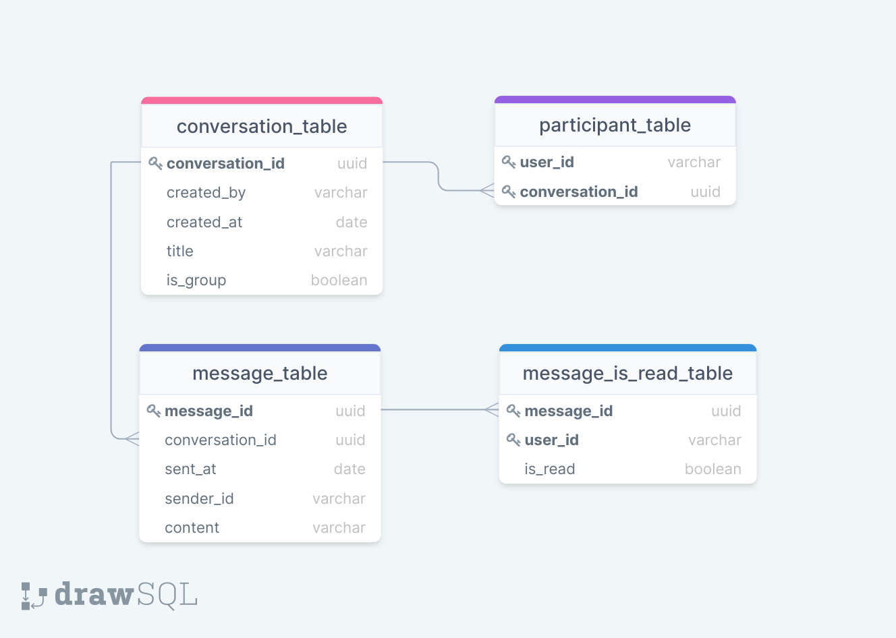

[English README.md](./README.md)

PageNow 홈페이지: https://pagenow.io <br/>
PageNow 크롬 웹스토어: https://chrome.google.com/webstore/detail/pagenow/lplobiaakhgkjcldopgkbcibeilddbmc

# Chat API

Chat API는 메시지 기능을 제공합니다. 웹소켓 API로 실시간으로 메시지를 받고 보낼 수 있고, REST API로 대화와 메시지 기록을 얻을 수 있습니다.

## 시스템 아키텍쳐

### API 아키텍쳐 그림


### API 아키텍쳐 상세 그림


## 구성 요소

### AWS RDS (Postgres)

* AWS RDS는 AWS RDS Proxy를 통해 연결됩니다.

* 데이터베이스 스키마는 [user-api](https://github.com/PageNow/user-api)에 설명되어 있습니다.

* AWS RDS Postgres 연결에 대한 Lambda 함수의 권한 관리에 대한 코드는 [lib/chat-api-stack.ts](./lib/chat-api-stack.ts)에 있습니다.

### AWS Elasticache (Redis)

Redis 클러스터를 `chat_user_connection`, `chat_connection_user` 이렇게 2개의 필드를 사용합니다.

* `chat_user_connection`는 { user_id: connection_id }를 저장하고, `chat_connection_user`는 { connection_id: user_id }를 저장합니다. 이는 사용자의 WebSocket API 연결을 관리하는 데에 사용됩니다.

### AWS Aurora (PostgreSQL Serverless)

쉬운 오토 스케일링을 위해 서버리스 Aurora PostgreSQL을 데이터베이스로 사용합니다. 채팅과 관련된 모든 정보를 저장하고, 테이블 정의는 [db_init.sql](./db_init.sql)에 있습니다.

* `conversation_table`는 대화에 대한 메타 데이터를 저장합니다.

* `participant_table`는 대화와 참가하는 사용자 간의 관계를 저장합니다. 각 행은 [대화, 사용자] 쌍을 담고 있습니다.

* `message_table`은 메시지 데이터를 저장합니다. *conversation_id*열을 통해 메시지가 어떤 대화 내에서 전송되었는지를 알 수 있습니다.

* `message_is_read_table`은 사용자가 메시지를 읽었는지 안 읽었는지를 저장합니다.

데이터베이스 스키마 그림은 다음과 같습니다.



### AWS Lambda

모든 기능은 AWS Lambda 함수로 구현 되었습니다.

* `heartbeat`는 크롬 익스텐션의 `background.js`가 5분에 한 번 웹소켓을 통해 실행합니다. AWS WebSocket API는 10분 동안 활동이 없으면 자동으로 연결이 끊기기 때문에 heartbeat를 보냄으로써 연결을 유지시킵니다.

* `connect`는 사용자가 웹소켓에 연결하면 실행됩니다. 사용자의 연결 아이디는 *chat_user_connection*와 *chat_connection_user* Redis 필드에 저장됩니다.

* `close_connection`는 사용자가 웹소켓 연결을 종료하면 실행됩니다. 사용자의 연결 아이디를 Redis에서 지웁니다.

* `send_message`는 사용자가 웹소켓을 통해 메시지를 보낼 때 실행됩니다. *message_table*에 새 메시지를 저장하고, 온라인인 친구들에게는 웹소켓을 통해 메시지를 전달합니다.

* `read_messages`는 사용자가 메시지를 읽으면 웹소켓을 통해 실행됩니다. *message_is_read_table*의 데이터를 업데이트합니다. 

* `get_user_conversations`는 사용자의 대화를 최신 메시지 내용, 메시지 읽음 여부 등과 같은 추가 정보와 같이 제공합니다. REST API를 통해 실행되고, 결과는 사용자의 대화 목록 창에 사용됩니다.

* `get_conversation_messages`는 대화의 메시지를 제공하는 함수로 REST API에 의해 실행됩니다.

* `get_conversation_participants`는 대화에 참가한 사용자 목록을 제공하며 REST API에 의해 실행됩니다.

* `get_user_direct_conversation`는 사용자와 다른 사용자 간의 일대일 대화를 제공합니다. 대화가 없으면 null을 리턴합니다. REST API에 의해 실행됩니다. 개인 메시지를 보낼 때 대화 아이디를 찾는 데에 사용됩니다.

* `create_conversation`는 새로운 대화를 생성하는 함수로 REST API에 의해 실행됩니다.

* `get_conversation`는 입력값에 따른 대화에 대한 정보를 제공하는 함수로 REST API에 의해 실행됩니다.

### AWS API Gateway

* REST API - 사용자들의 채팅 데이터를 제공하는 엔드포인트.

* Websocket API - 크롬 익스텐션의 `background.js`와 연결한 후 메시지를 실시간으로 주고 받을 수 있는 엔드포인트

## 세팅

### 환경 변수

`.env`에 다음 환경 변수를 설정합니다.
```
COGNITO_REGION=<AWS region>
COGNITO_POOL_ID=<AWS Cognito User Pool Id>

VPC_ID=<VPC of the backend>
PRIVATE_ROUTE_TABLE1_ID=<Route Table1 id of subnets AWS RDS resides in>
PRIVATE_ROUTE_TABLE2_ID=<Route Table2 id of subnets AWS RDS resides in>
PRIVATE_SUBNET1_ID=<Id of subnet1 AWS RDS resides in>
PRIVATE_SUBNET2_ID=<Id of subnet2 AWS RDS resides in>

SUBNET1_AZ=<Availability zone of subnet1 (e.g. us-west-2a)>
SUBNET2_AZ=<Availability zone of subnet2>

RDS_PROXY_SG_ID=<Security Group of AWS RDS Proxy>
RDS_PROXY_HOST=<AWS RDS Proxy Host>
RDS_PORT=<AWS RDS Port Number>
RDS_DB_NAME=<AWS RDS database name>
RDS_USERNAME=<AWS RDS username>
RDS_PASSWORD=<AWS RDS password>

RDS_PROXY_ARN=<AWS RDS Proxy arn>
RDS_PROXY_NAME=<AWS RDS Proxy name>

LAMBDA_SG_ID=<AWS Lambda Security Group if it exists. 'none' otherwise>
REDIS_SG_ID=<AWS Elasticache Security Group if it exists. 'none' otherwise>
REDIS_ENDPOINT_ADDRESS=<Elasticache primary endpoint host if it exists. 'none' otherwise>
REDIS_ENDPOINT_PORT=<Elasticache primary endpoint port if it exists. 'none' otherwise>

REST_API_DEPLOY_STAGE=prod
WEBSOCKET_API_DEPLOY_DEV_STAGE=dev
WEBSOCKET_API_DEPLOY_PROD_STAGE=prod

CLIENT_URL=<Url of the chat client>
```

### CDK Bootstrap

프로젝트 시작할 때, 다음 명령으로 AWS CDK를 bootstrap할 수 있습니다.
```shell
$ cdk bootstrap aws://<AWS Account Id>/<AWS Region>
```
더 자세한 정보는 https://docs.aws.amazon.com/cdk/latest/guide/bootstrapping.html에 있습니다.

## 배포

1. 아래 명령어를 실행합니다.
```shell
$ cdk deploy --outputs-file presence.json
```

2. `autoDeploy`를 설정하지 않았기 때문에 AWS API Gateway 콘솔에서 ChatWebsocketApi Prod API를 직접 배포해야 합니다.

## 데이터베이스 세팅

AWS RDS 콘솔의 `Query Editor` 메뉴에서 [db_init.sql](./db_init-sql)의 내용을 복사한 후 실행합니다.

## 테스트

현재 테스트는 제대로 작동하지 않습니다. 곧 업데이트 될 예정입니다.
